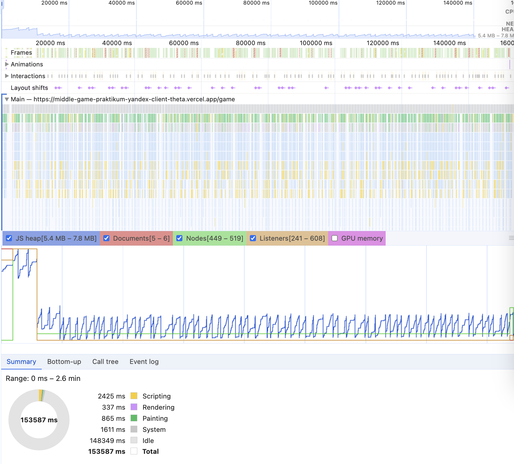

# Memory Leaks

## Среда тестирования

- Браузер: Google Chrome (версия 131.0.6778.86 Official Build)
- Расширения: Все отключены
- Версия React: 18.2.0
- Развёртывание: Vercel
- Инструменты тестирования: Chrome DevTools (вкладки “Memory” и “Performance”)

## Выявленные симптомы

- Увеличение памяти на ~0.1 Mb при смене страниц (около 20 переходов).
- Всплеск использования памяти в первые 10 секунд игры.
- Постепенное накопление объектов (функции и массивы) в течение игрового процесса.

## Процесс анализа

1. Снимки памяти (Heap Snapshots)
  
    **Утечки в процессе игры**  
    - Первый снимок (5.7Mb) и второй (5.9Mb) показали прирост памяти примерно на 0.2Mb после первого раунда игры (1.5 минуты).  
    - Основные остающиеся объекты: функции и массивы, что может указывать на временные структуры, которые не освобождаются сразу.  
    - Отсутствие `detached` объектов подтверждает, что удаленные DOM-узлы корректно освобождаются сборщиком мусора.

    **Утечки в процессе смены страниц**  
    - При переходах между страницами (20 переходов) замечен прирост памяти на 0.1Mb.  
    - Увеличение связано с объектами типа `compiled code`, что может указывать на кэширование или повторные компиляции.

2. Performance

    - За время раунда игры (2.6 минуты) размер кучи варьировался от 5.4Mb до 7.8Mb.  
    - Всплеск в первые 10 секунд игры связан с инициализацией слушателей событий и созданием начальных данных. После этого сборщик мусора стабилизировал память.  
    - Частота работы сборщика мусора (каждые 2.5 секунды) указывает на нормальное поведение для такого типа приложения.

    

3. Lighthouse

    Перфоманс главной страницы игрока по метрикам Google Lighthouse составил 92 балла:

    

## Правки

Проведена проверка использования `useRef` для хранения ссылок на DOM-элементы. Добавлены функции очистки в `useEffect`:

```jsx
useEffect(() => {
  return () => {
    fileInputRef.current = null
  };
}, []);
```

## Выводы

- Все слушатели событий, добавляемые в useEffect, корректно удаляются при размонтировании компонента.
- Компоненты корректно удаляются из дерева React, а лишние объекты освобождаются сборщиком мусора.
- В проекте используются хуки, чтобы исключить захват старых пропсов и состояний.
- Производительность приложения на высоком уровне.
